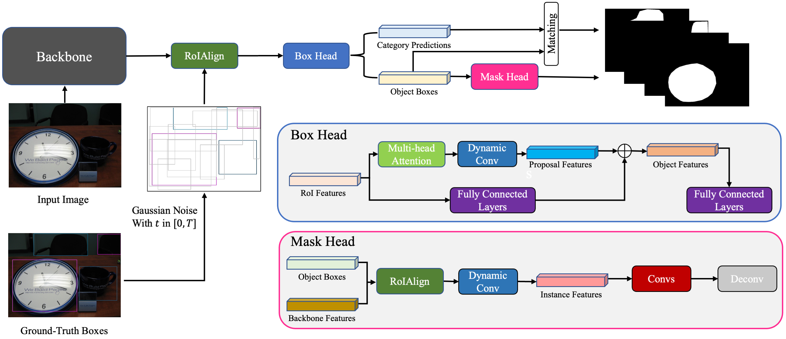

# IDIP

A PyTorch implementation of IDIP based on ECAI 2023 paper
[Instance-aware Diffusion Implicit Process for Box-based Instance Segmentation]().



## Requirements

- [Anaconda](https://www.anaconda.com/download/)
- [PyTorch](https://pytorch.org)

```
conda install pytorch torchvision torchaudio pytorch-cuda=11.8 -c pytorch -c nvidia
```

- [Detectron2](https://detectron2.readthedocs.io/en/latest/)

```
conda install tensorboard
conda install -c conda-forge pycocotools
pip install opencv-python-headless
pip install git+https://github.com/facebookresearch/detectron2.git
```

- [MMDetection](https://mmdetection.readthedocs.io/en/latest/)

```
pip install openmim
mim install mmcv 
mim install mmdet
```

## Usage

Set th environment variable DETECTRON2_DATASETS to the directory where the dataset saved, for example:
`export DETECTRON2_DATASETS=/home/data`. Then download the backbone weights
from [MEGA](https://mega.nz/folder/mSg00RZS#tkb1KdwIGZRTqcWnPZov7A), put them in `results`.

To train the model with `resnet50` backbone on `COCO 2017 Train` dataset:

```
python main.py --config-file configs/res50.yaml --num-gpus 2
```

Using tensorboard to visualize the training process:

```
tensorboard --logdir=results --bind_all
```

To evaluate the model with `resnet50` backbone on `COCO 2017 Val` dataset:

```
python main.py --config-file configs/res50.yaml --eval-only MODEL.WEIGHTS results/model.pth
```

To visualize the results of a given image by using the pre-trained model:

```
python demo.py --config-file configs/res50.yaml --input image.jpg --output out.jpg --opts MODEL.WEIGHTS results/model.pth
```

## Benchmarks

The models are trained on two NVIDIA Tesla V100-SXM2-32GB GPUs, and tested on `COCO 2017` dataset.
All the hyper-parameters are the default values.

| Backbone                          | AP<sub>Val</sub> | AP<sub>Test</sub> | AP<sub>50</sub> | AP<sub>75</sub> | AP<sub>S</sub> | AP<sub>M</sub> | AP<sub>L</sub> |                                     Download                                      |
|-----------------------------------|:----------------:|:-----------------:|:---------------:|:---------------:|:--------------:|:--------------:|:--------------:|:---------------------------------------------------------------------------------:|
| [ResNet-50](configs/res50.yaml)   |       39.5       |       40.2        |      63.0       |      43.7       |      22.2      |      43.3      |      53.3      | [MEGA](https://mega.nz/file/qfxDBJII#44X2y4CONSRfTuG2FE0kFwneSnYVYltbOqzxTdysXIQ) |
| [ResNet-101](configs/res101.yaml) |       40.4       |       41.9        |      65.1       |      45.5       |      22.8      |      45.2      |      55.7      | [MEGA](https://mega.nz/file/uS4iTKAQ#2Gy9Z_QdMgV4OAHnCZapL1tNDXf6N4IWAYFw2VJx3_I) |

## Results


